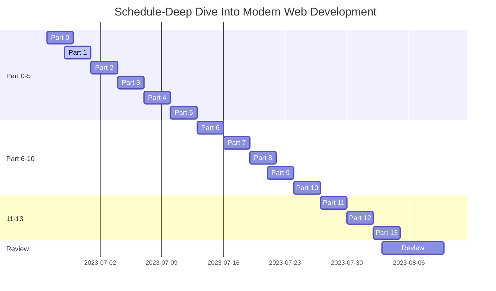

#Hi
<!-- DcViet introduce.md -->
<div align="center"> 
<span></span>
</div>  
<div align="center">
<span></span>
</div>

#

<div>
  
  <a href="https://github.com/DcViet"></a>
  <blockquote>
    <p></p>
    <p></p>
  </blockquote>
</div>

<sub> :raccoon: Emoji [link](https://github.com/ikatyang/emoji-cheat-sheet/blob/master/README.md) | :owl: 20:00 - 3:00 </sub>

<sub>
My Self-Taught Learning Journey: 
  
- Course:

>[Beginner Full Stack Web Development: HTML, CSS, React & Node](https://stackskills.com/p/beginner-full-stack-web-development-html-css-react-node) | loading..70%

>[Deep Dive Into Modern Web Development](https://fullstackopen.com/en/) | my schedule below..
</sub>

<table style="padding: 2px;" >
  <tr>
    <td> <h5>input</h2></td>
    <td> <h5>coding</h2></td>
    <td> <h5>result</h2></td>

  </tr>	
  <tr>
    <td></td>
    <td></td>
    <td></td>    
<!--</td> -->
  </tr>
  <tr>
    <td></td>
    <td></td>
    <td> </td>  
  </tr>
</table>

<h3><strong> :eye_speech_bubble: ":people_hugging:"</strong></h3>
<a href="https://github.com/DcViet"></a>

</a>
&nbsp;&nbsp;&nbsp;
<a href="https://github.com/DcViet"></a>

<div
:octocat:
- [Scan grab receipt](https://github.com/DcViet/Scan_grabReceipt.git) :trollface: 
- [Maximal Rectangle Algorithm](https://github.com/DcViet/Maximal-Rectangle-Algorithm.git)
- [beginnerFullStackWebDev_stackskill](https://github.com/DcViet/beginnerFullStackWebDev_stackskill.git)
- [Subjects at My University]()
- [And more..]()

<!--<td></td>-->
<!--
<picture>
  <source
    srcset="https://github-readme-stats.vercel.app/api?username=DcViet&show_icons=true&theme=react"
    media="(prefers-color-scheme: dark)"
  />
  <source
    srcset="https://github-readme-stats.vercel.app/api?username=DcViet&show_icons=true"
    media="(prefers-color-scheme: light), (prefers-color-scheme: no-preference)"
  />
  
</picture>
 

--> 

> **Note**
> note

> **Warning**
> warning


<!-- 
```stl
solid cube_corner
  facet normal 0.0 -1.0 0.0
    outer loop
      vertex 0.0 0.0 0.0
      vertex 1.0 0.0 0.0
      vertex 0.0 0.0 1.0
    endloop
  endfacet
  ...
```
-->



/
